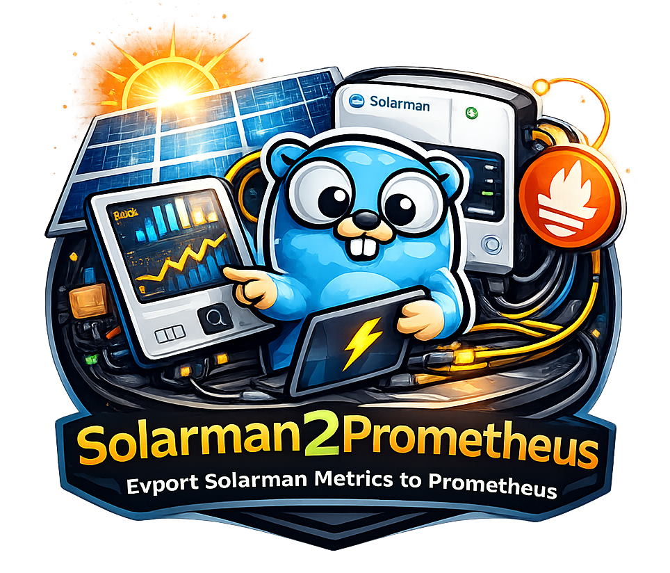

<p style="text-align: center">

</p>

# ☀️ solarman_exporter

A simple **Prometheus exporter** for **SOLARMAN Smart (Solarman OpenAPI)**.  
It polls Solarman Cloud on a fixed interval and exposes metrics for **Prometheus + Grafana**.

---

## ✨ Highlights

- 🔐 Solarman OpenAPI token auth (password is **SHA256-hashed**)
- 🔎 Auto-discovery: stations → station devices (or set device SNs manually)
- ⏱️ Polling loop with caching (does **not** hit the API per scrape)
- 📊 Prometheus-ready metrics for Grafana dashboards
- 🧩 Metric groups: **pv, inverter, grid, battery, bms, gen, load (ups), house**
- 🐳 Docker Compose guide included (Exporter + Prometheus + Grafana)

---

## 📈 Metrics

### ✅ Health

- `solarman_device_up{device_sn}`  
  `1` if last poll for device succeeded, else `0`.

- `solarman_last_update_timestamp_seconds{device_sn}`  
  Unix timestamp of last successful refresh.

### 🧩 Grouped metrics

Each group exposes:

- `solarman_<group>_metric{device_sn,key,name,unit}`

Groups:
- `solarman_pv_metric`
- `solarman_inverter_metric`
- `solarman_grid_metric`
- `solarman_battery_metric`
- `solarman_bms_metric`
- `solarman_gen_metric`
- `solarman_load_metric` — UPS/backup/output
- `solarman_house_metric` — house/home consumption

### 🧺 Generic (optional)

- `solarman_metric{device_sn,key,name,unit}`

Enable/disable with `--enable-generic` / `SOLARMAN_ENABLE_GENERIC`.

> ⚠️ Label-heavy metrics can grow cardinality. Prefer grouped metrics + filters.

---

## 🔑 Credentials & prerequisites

You typically need **two things**:

### 1) Solarman Smart account
- Your Solarman Smart **email** + **password**
- Your plant/device must already be visible in the Solarman Smart app/portal

### 2) Solarman OpenAPI access
You must request OpenAPI credentials:
- `appId`
- `appSecret`

These are not normally visible in the Solarman Smart UI. [How to request them ](https://doc.solarmanpv.com/en/Documentation%20and%20Quick%20Guide#access-process)

### 🧾 Device serial number (SN)
You can find the datalogger/inverter SN:
- on the physical device sticker/label, or
- in Solarman Smart device list (after adding it)

---

## 🌍 Base URL (region notes)

Regional API domains may vary. Common options:
- `https://globalapi.solarmanpv.com`
- `https://api.solarmanpv.com`

If you see auth errors, try switching `SOLARMAN_BASE_URL`.

---

## 🐳 Docker Compose

### 🧩 docker-compose.yml

Create `docker-compose.yml` in the repository root:

```yaml
services:
  solarman_exporter:
    image: rcooler/solarman_exporter:latest
    container_name: solarman_exporter
    restart: unless-stopped
    environment:
      # --- Solarman OpenAPI ---
      SOLARMAN_BASE_URL: "https://globalapi.solarmanpv.com"
      SOLARMAN_API_VERSION: "v1.0"
      SOLARMAN_LANGUAGE: "en"

      SOLARMAN_APP_ID: "${SOLARMAN_APP_ID}"
      SOLARMAN_APP_SECRET: "${SOLARMAN_APP_SECRET}"
      SOLARMAN_EMAIL: "${SOLARMAN_EMAIL}"

      # Use ONE of these:
      SOLARMAN_PASSWORD_SHA256: "${SOLARMAN_PASSWORD_SHA256}"
      # SOLARMAN_PASSWORD: "${SOLARMAN_PASSWORD}"

      # Optional (if auto-discovery doesn't work):
      # SOLARMAN_DEVICE_SN: "1234567890,0987654321"
      # SOLARMAN_STATION_ID: "0"

      # Exporter runtime
      SOLARMAN_POLL_INTERVAL: "60s"
      SOLARMAN_HTTP_TIMEOUT: "15s"
      SOLARMAN_YEARLY_REQUEST_LIMIT: "200000"
      SOLARMAN_DISCOVERY_REFRESH_INTERVAL: "24h"
      SOLARMAN_ENABLE_GENERIC: "true"
      SOLARMAN_EXPORTER_LOG_LEVEL: "info"
      SOLARMAN_EXPORTER_METRICS_PATH: "/metrics"
      SOLARMAN_EXPORTER_LISTEN: ":9876"

    ports:
      - "9876:9876"
```

### 🧲 Prometheus scrape config

Create `prometheus/prometheus.yml`:

```yaml
global:
  scrape_interval: 30s

scrape_configs:
  - job_name: solarman
    metrics_path: /metrics
    static_configs:
      - targets: ["solarman_exporter:9876"]
```

## 🧠 Notes / Caveats

- Solarman API payloads vary by inverter model; grouping is keyword/unit-based.
- If you want **strict non-overlapping groups**, use “first match wins” logic (put `totals` first).
- Label-heavy metrics can increase Prometheus cardinality; disable generic metrics if needed.
- `SOLARMAN_YEARLY_REQUEST_LIMIT` spaces outbound API calls across the year. Set `0` to disable throttling.
- `SOLARMAN_DISCOVERY_REFRESH_INTERVAL` controls how often station/device auto-discovery is refreshed. Set `0` to cache forever.
